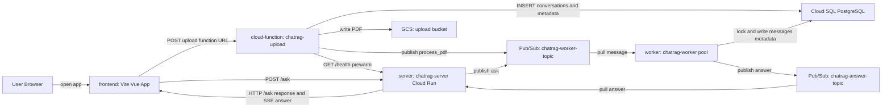
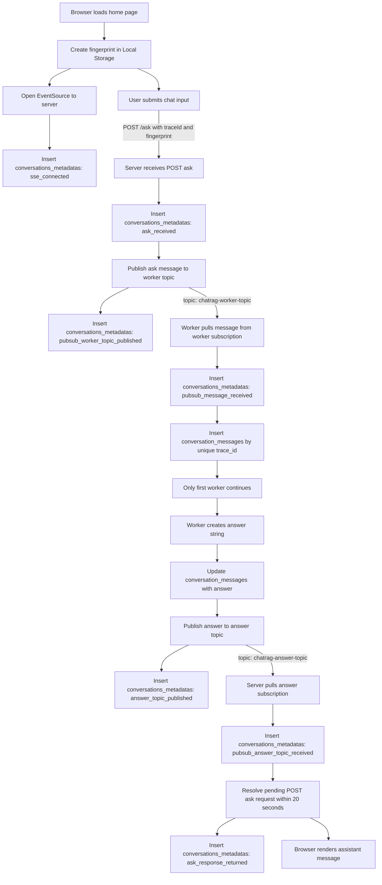
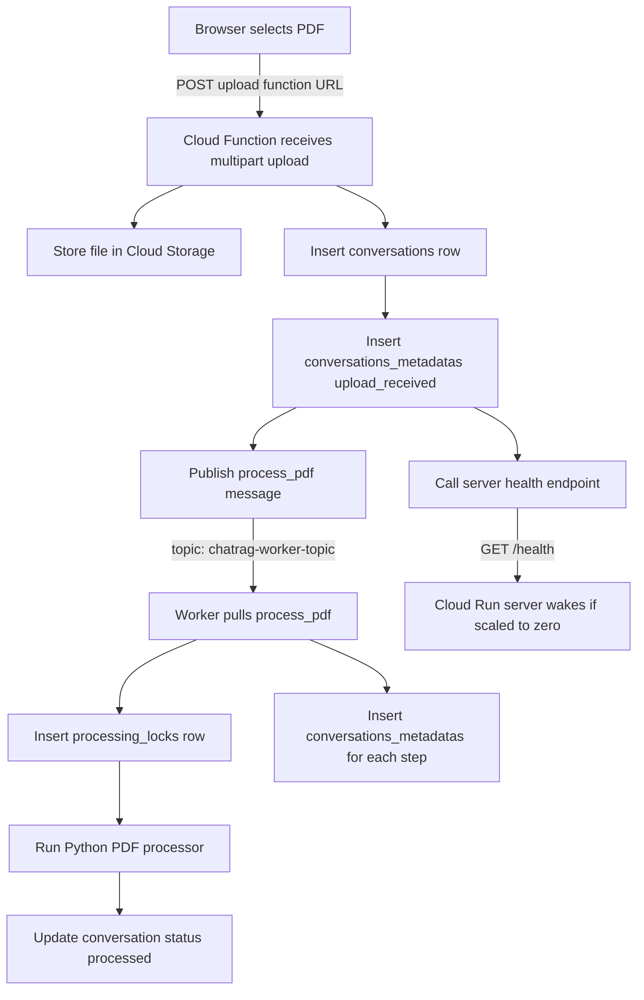

# ChatRAG - GCP Option A multi-env

This repository is a small production-shaped ChatRAG skeleton for the new GCP project `chatrag-app`.

Option A means:

- `chatrag.app` stays mapped to the old GCP project for now.
- this new project uses generated GCP URLs:
  - Cloud Run server: `https://<service>-<project-number>.<region>.run.app`
  - Cloud Function upload: `https://<region>-<project-id>.cloudfunctions.net/<function>`
  - Cloud Run Worker Pool: no public HTTP URL
- later, after detaching the old project, map `chatrag.app` to the new Cloud Run server.

## Structure

```text
frontend/        Vite + Vue 3 + TypeScript app
server/          TypeScript Node/Express server, SPA hosting, SSE, /ask
cloud-function/  upload function: file -> GCS -> DB -> Pub/Sub
worker/          Python Pub/Sub worker with PostgreSQL locks and answer publishing
infra/           dev/prod envs, schema, deploy script
docs/            extra architecture notes
```

## Local frontend dev

```bash
cd frontend
npm install
npm run dev
```

Vite serves `frontend/index.html` on `http://localhost:5173`.

## Deploy prod by default

```bash
./infra/deploy-gcp.sh
```

## Deploy dev explicitly

```bash
ENV=dev ./infra/deploy-gcp.sh
```

## Root Diagram: High-level system flow



## Root Diagram: Detailed event and metadata flow



## Root Diagram: Upload PDF flow



## Multi-env naming

`infra/.env.dev` uses names like:

- `chatrag-dev-server`
- `chatrag-dev-upload`
- `chatrag-dev-worker`
- `chatrag-dev-worker-topic`

`infra/.env.prod` uses final names like:

- `chatrag-server`
- `chatrag-upload`
- `chatrag-worker`
- `chatrag-worker-topic`

## Domain migration later

This ZIP does not map `chatrag.app`.

When you are ready to replace the old project:

1. delete old Cloud Run domain mapping for `chatrag.app`
2. verify the domain in the new project if needed
3. create Cloud Run domain mapping for `chatrag-server`
4. update DNS at registrar
5. set `VITE_APP_BASE_URL=https://chatrag.app` in `infra/.env.prod`
6. redeploy `./infra/deploy-gcp.sh`

## GitHub Actions

This repository includes two workflows:

- `.github/workflows/build.yml` - builds and checks frontend, server, cloud-function, and worker.
- `.github/workflows/deploy.yml` - deploys to GCP on push to branch `2.0` and can also be started manually.

Required GitHub Secrets for deploy:

```text
GCP_SERVICE_ACCOUNT_KEY
```

Optional GitHub Secrets used to create `infra/.env.prod.local` or `infra/.env.dev.local` during CI deploy:

```text
DB_PASSWORD
VITE_SENTRY_DSN
SENTRY_SERVER_DSN
SENTRY_WORKER_DSN
SENTRY_CLOUD_FUNCTION_DSN
SENTRY_AUTH_TOKEN
```

The committed `infra/.env.prod` and `infra/.env.dev` files contain non-secret defaults and empty secret placeholders. Locally, put real secrets into `infra/.env.prod.local` or `infra/.env.dev.local`; those files are ignored by git.
