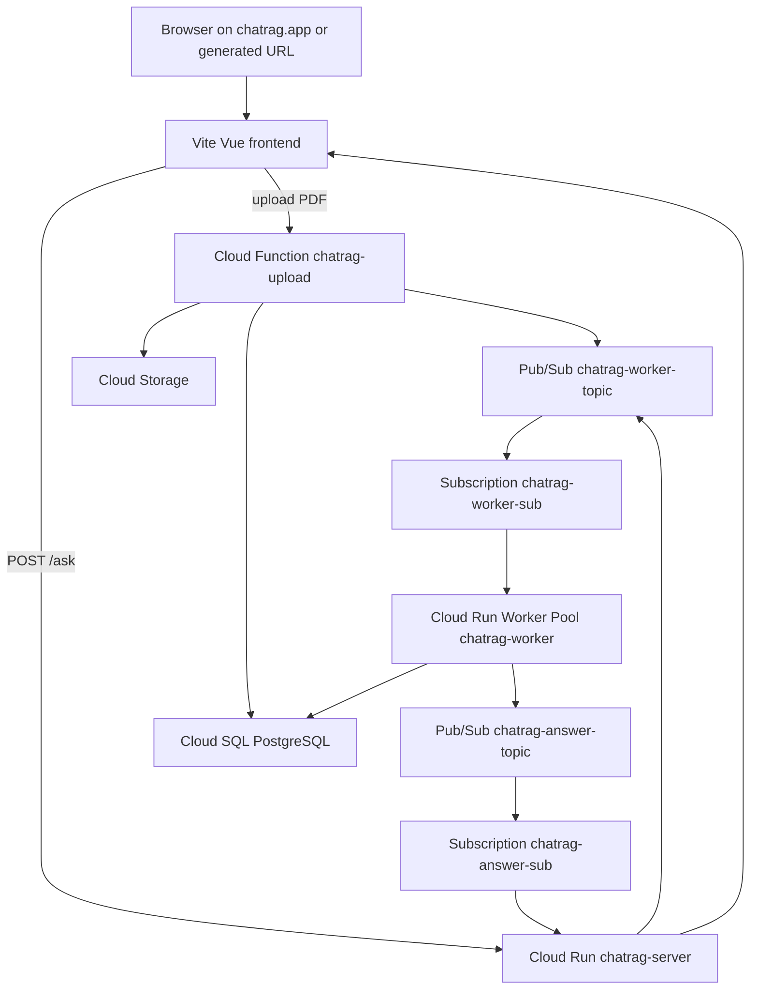
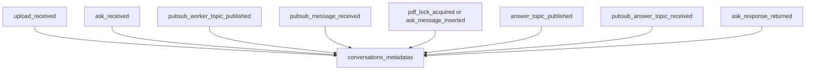

# Architecture

## Diagram: Option A runtime architecture

## Diagram: Metadata debug trail

## Why max server instances is 1

The basic `/ask` implementation stores pending requests in memory while waiting up to `ASK_TIMEOUT_MS` for the answer Pub/Sub message. Keep `SERVER_MAX_INSTANCES=1` for this architecture.

For multi-instance production, move pending request correlation to Redis/Memorystore, Firestore, Cloud SQL polling, or a WebSocket/SSE fanout service.
