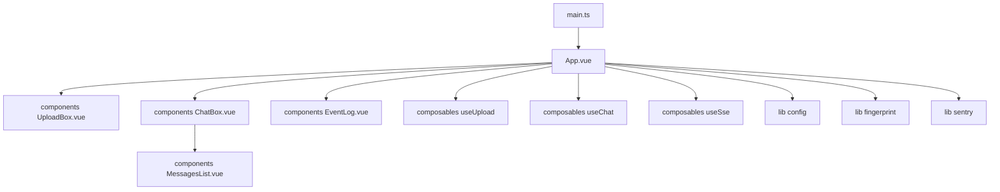
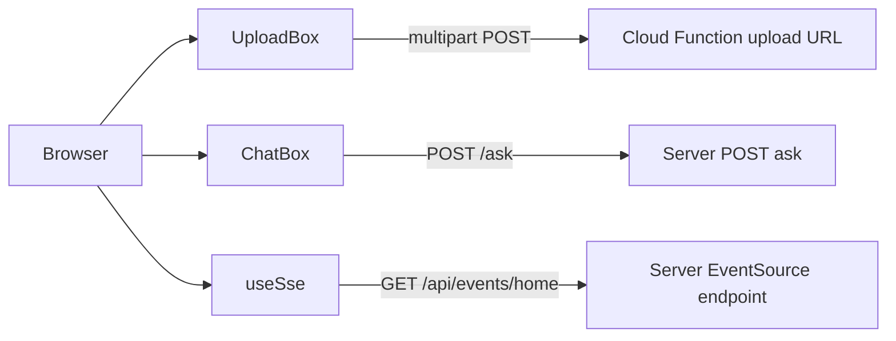

# Frontend

Vite + Vue 3 + TypeScript browser app.

## Diagram: Frontend modules

```mermaid
flowchart TD
    Main["main.ts"]
    App["App.vue"]
    Upload["components UploadBox.vue"]
    Chat["components ChatBox.vue"]
    Messages["components MessagesList.vue"]
    Events["components EventLog.vue"]
    UseUpload["composables useUpload"]
    UseChat["composables useChat"]
    UseSse["composables useSse"]
    Config["lib config"]
    Fingerprint["lib fingerprint"]
    Sentry["lib sentry"]

    Main --> App
    App --> Upload
    App --> Chat
    App --> Events
    Chat --> Messages
    App --> UseUpload
    App --> UseChat
    App --> UseSse
    App --> Config
    App --> Fingerprint
    App --> Sentry
```

## Diagram: Frontend data flow

```mermaid
flowchart LR
    Browser["Browser"]
    Upload["UploadBox"]
    Chat["ChatBox"]
    Sse["useSse"]
    UploadFunction["Cloud Function upload URL"]
    ServerAsk["Server POST ask"]
    ServerEvents["Server EventSource endpoint"]

    Browser --> Upload
    Browser --> Chat
    Browser --> Sse
    Upload -->|"multipart POST"| UploadFunction
    Chat -->|"POST /ask"| ServerAsk
    Sse -->|"GET /api/events/home"| ServerEvents
```
