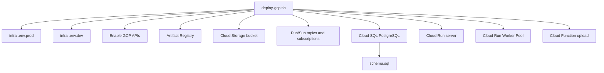
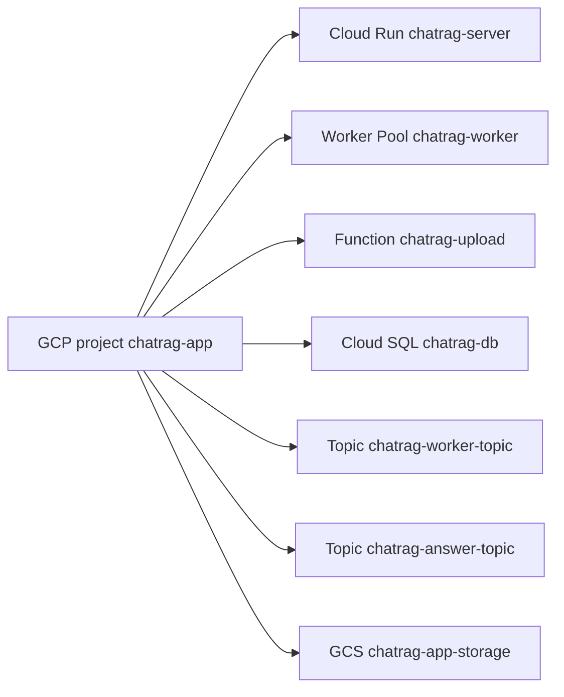

# Infra

Bash-based multi-env deployment for macOS.

## Diagram: Infra deploy flow

```mermaid
flowchart TD
    Deploy["deploy-gcp.sh"]
    EnvProd["infra .env.prod"]
    EnvDev["infra .env.dev"]
    APIs["Enable GCP APIs"]
    Registry["Artifact Registry"]
    Bucket["Cloud Storage bucket"]
    PubSub["Pub/Sub topics and subscriptions"]
    Database["Cloud SQL PostgreSQL"]
    Schema["schema.sql"]
    Server["Cloud Run server"]
    Worker["Cloud Run Worker Pool"]
    Function["Cloud Function upload"]

    Deploy --> EnvProd
    Deploy --> EnvDev
    Deploy --> APIs
    Deploy --> Registry
    Deploy --> Bucket
    Deploy --> PubSub
    Deploy --> Database
    Database --> Schema
    Deploy --> Server
    Deploy --> Worker
    Deploy --> Function
```

## Diagram: GCP resources

```mermaid
flowchart LR
    Project["GCP project chatrag-app"]
    Run["Cloud Run chatrag-server"]
    WorkerPool["Worker Pool chatrag-worker"]
    Function["Function chatrag-upload"]
    Sql["Cloud SQL chatrag-db"]
    Topic1["Topic chatrag-worker-topic"]
    Topic2["Topic chatrag-answer-topic"]
    Bucket["GCS chatrag-app-storage"]

    Project --> Run
    Project --> WorkerPool
    Project --> Function
    Project --> Sql
    Project --> Topic1
    Project --> Topic2
    Project --> Bucket
```
