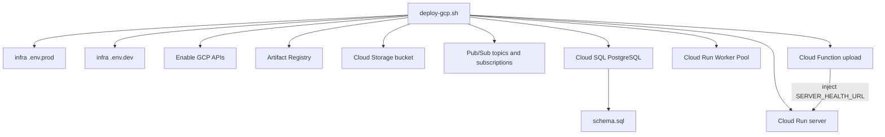
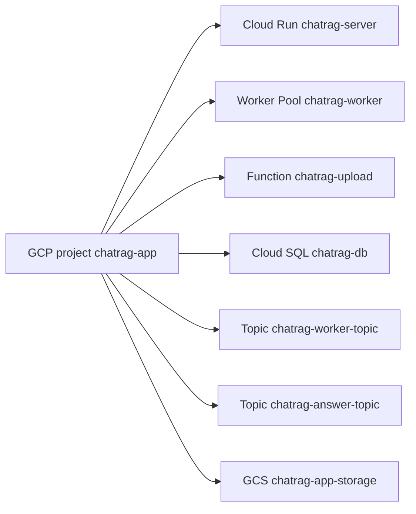
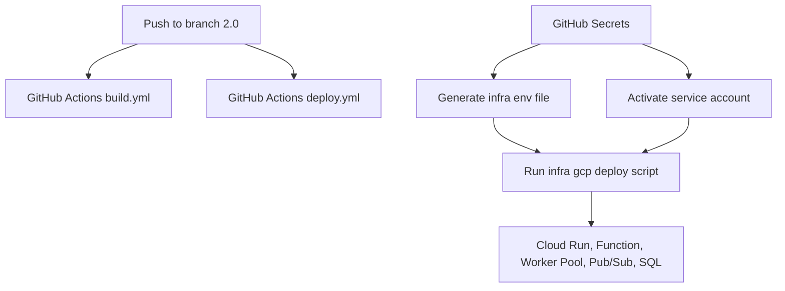

# Infra

Bash-based multi-env deployment for macOS.

## Diagram: Infra deploy flow



## Diagram: GCP resources




## Diagram: CI/CD workflow



## Performance notes

- Dockerfiles use BuildKit cache mounts for npm and pip downloads.
- Runtime images are slim Node/Python images with build dependencies left in intermediate stages.
- Cloud Run server uses min instances from env; set `SERVER_MIN_INSTANCES=0` for cheapest idle behavior.
- Worker Pool can be paused by setting `WORKER_INSTANCES=0`.

## Env files

`infra/.env.dev` and `infra/.env.prod` are committed templates with non-secret defaults and empty secret placeholders.

For local deploys, copy one of the examples and fill secrets:

```bash
cp infra/.env.prod.local.example infra/.env.prod.local
cp infra/.env.dev.local.example infra/.env.dev.local
```

`gcp-deploy.sh` loads the base env first, then overlays `.local` values when the file exists.

GitHub Actions does the same thing: it keeps the committed env file and creates only a small `.env.<env>.local` file from GitHub Secrets.

## Cloud Run SSE prewarm

The SSE/HTTP server is deployed with `SERVER_MIN_INSTANCES=0` and `SERVER_REQUEST_TIMEOUT_SECONDS=3600`.
This minimizes idle cost while still allowing long-lived SSE requests.

After frontend upload calls the Cloud Function, the function calls `GET /health` on the Cloud Run server through `SERVER_HEALTH_URL`.
The deploy script injects the real URL after the server is deployed:

```text
https://<cloud-run-server-url>/health
```

This prewarms the server before the browser navigates to `/c/:uid` or opens an SSE connection.
