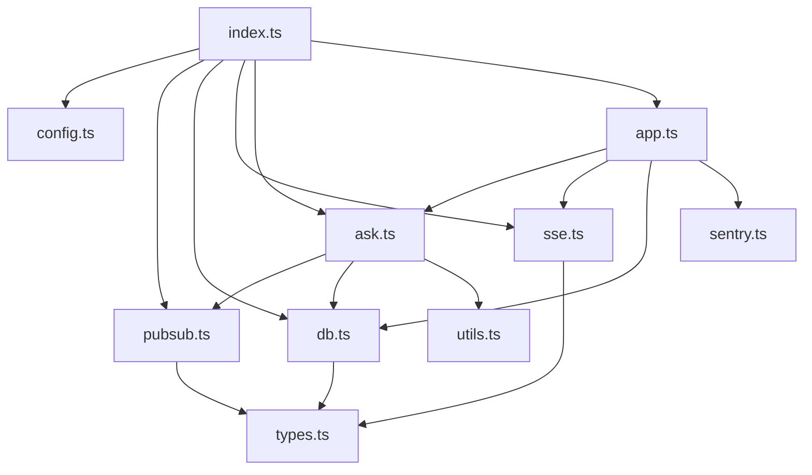
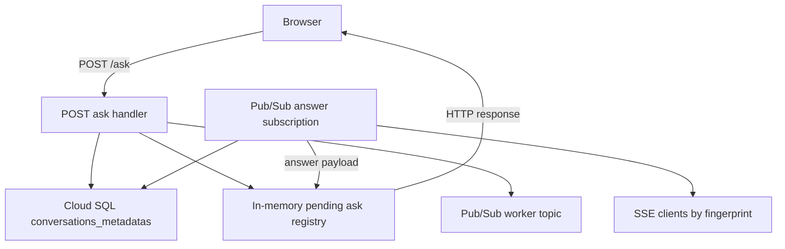

# Server

TypeScript Node/Express Cloud Run service.

## Diagram: Server modules

```mermaid
flowchart TD
    Index["index.ts"]
    App["app.ts"]
    Ask["ask.ts"]
    PubSub["pubsub.ts"]
    Sse["sse.ts"]
    Db["db.ts"]
    Config["config.ts"]
    Utils["utils.ts"]
    Sentry["sentry.ts"]
    Types["types.ts"]

    Index --> Config
    Index --> PubSub
    Index --> Db
    Index --> Sse
    Index --> Ask
    Index --> App
    App --> Ask
    App --> Sse
    App --> Db
    Ask --> PubSub
    Ask --> Db
    Ask --> Utils
    PubSub --> Types
    Sse --> Types
    Db --> Types
    App --> Sentry
```

## Diagram: Server runtime flow

```mermaid
flowchart TD
    Browser["Browser"]
    AskEndpoint["POST ask handler"]
    WorkerTopic["Pub/Sub worker topic"]
    AnswerSub["Pub/Sub answer subscription"]
    PendingMap["In-memory pending ask registry"]
    Metadata["Cloud SQL conversations_metadatas"]
    SseClients["SSE clients by fingerprint"]

    Browser -->|"POST /ask"| AskEndpoint
    AskEndpoint --> Metadata
    AskEndpoint --> PendingMap
    AskEndpoint --> WorkerTopic
    AnswerSub -->|"answer payload"| PendingMap
    AnswerSub --> Metadata
    AnswerSub --> SseClients
    PendingMap -->|"HTTP response"| Browser
```
