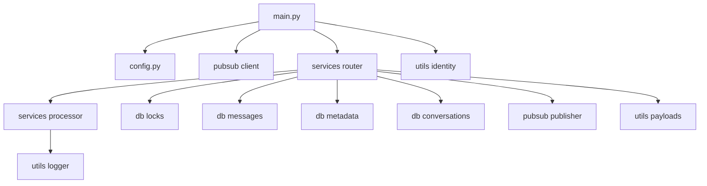
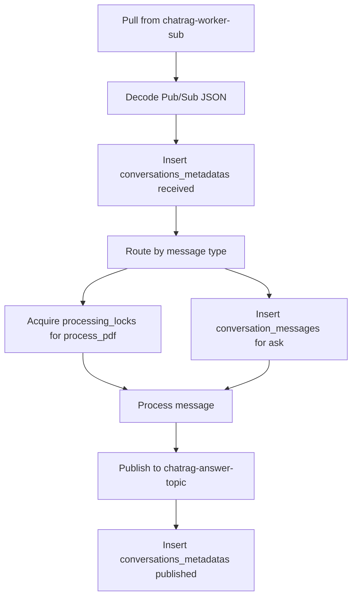

# Worker

Python Cloud Run Worker Pool consumer.

## Diagram: Worker modules

```mermaid
flowchart TD
    Main["main.py"]
    Config["config.py"]
    Subscriber["pubsub client"]
    Router["services router"]
    Processor["services processor"]
    Locks["db locks"]
    Messages["db messages"]
    Metadata["db metadata"]
    Conversations["db conversations"]
    Publisher["pubsub publisher"]
    Logger["utils logger"]
    Identity["utils identity"]
    Payloads["utils payloads"]

    Main --> Config
    Main --> Subscriber
    Main --> Router
    Main --> Identity
    Router --> Processor
    Router --> Locks
    Router --> Messages
    Router --> Metadata
    Router --> Conversations
    Router --> Publisher
    Router --> Payloads
    Processor --> Logger
```

## Diagram: Worker data flow

```mermaid
flowchart TD
    WorkerSub["Pull from chatrag-worker-sub"]
    Decode["Decode Pub/Sub JSON"]
    MetadataIn["Insert conversations_metadatas received"]
    TypeCheck["Route by message type"]
    PdfLock["Acquire processing_locks for process_pdf"]
    AskInsert["Insert conversation_messages for ask"]
    Process["Process message"]
    AnswerTopic["Publish to chatrag-answer-topic"]
    MetadataOut["Insert conversations_metadatas published"]

    WorkerSub --> Decode
    Decode --> MetadataIn
    MetadataIn --> TypeCheck
    TypeCheck --> PdfLock
    TypeCheck --> AskInsert
    PdfLock --> Process
    AskInsert --> Process
    Process --> AnswerTopic
    AnswerTopic --> MetadataOut
```
